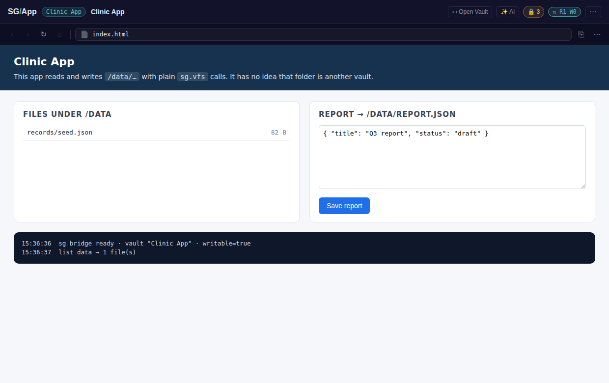
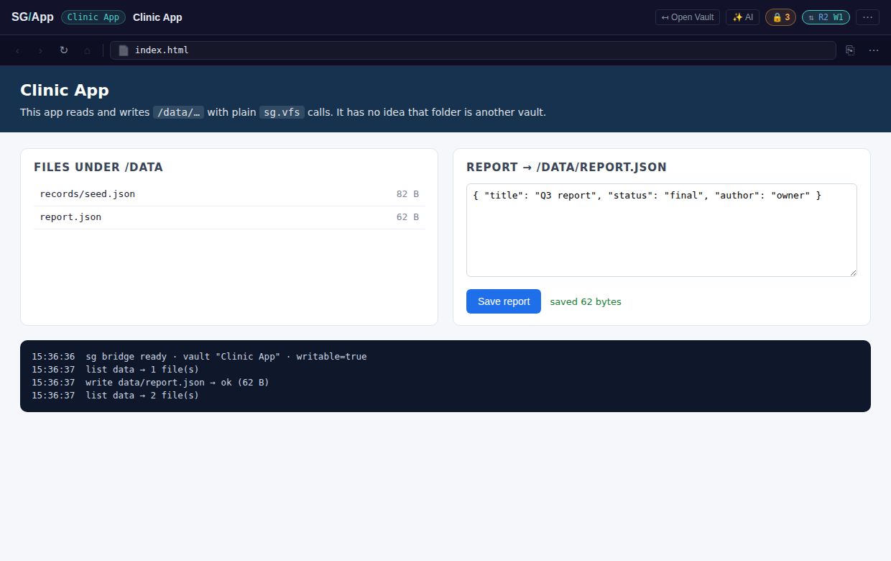
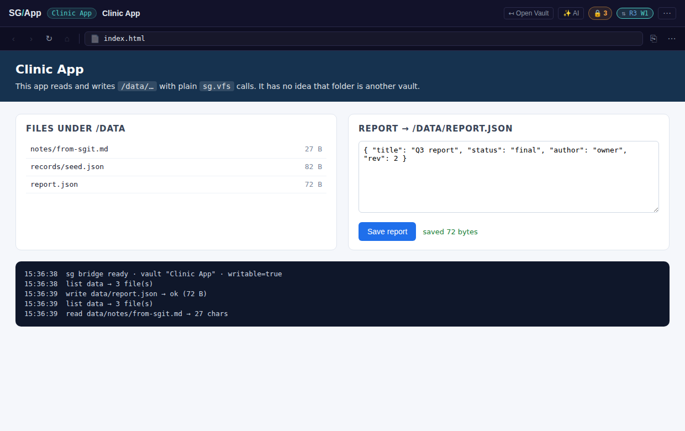
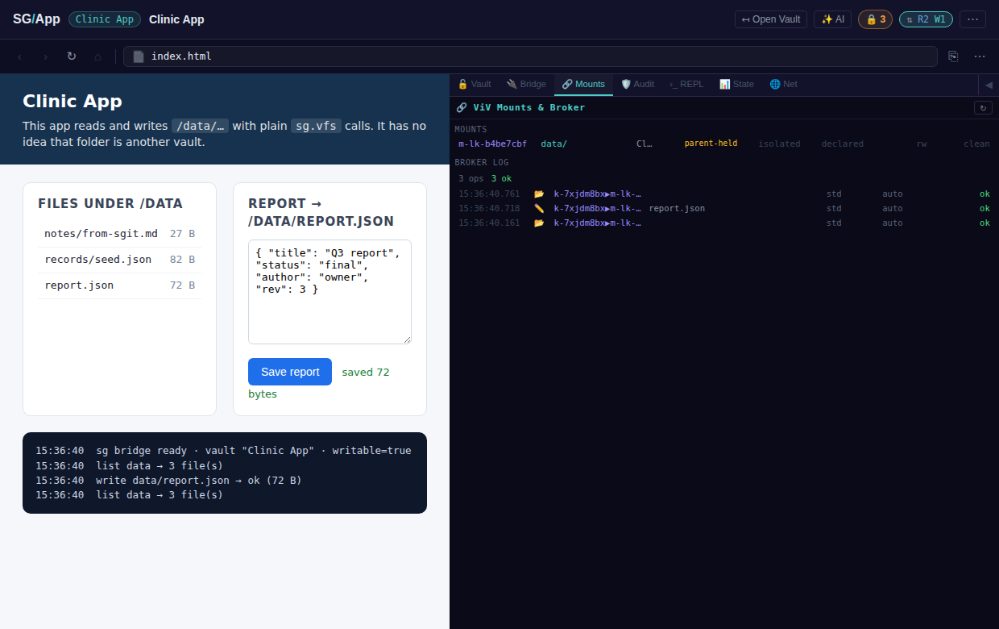
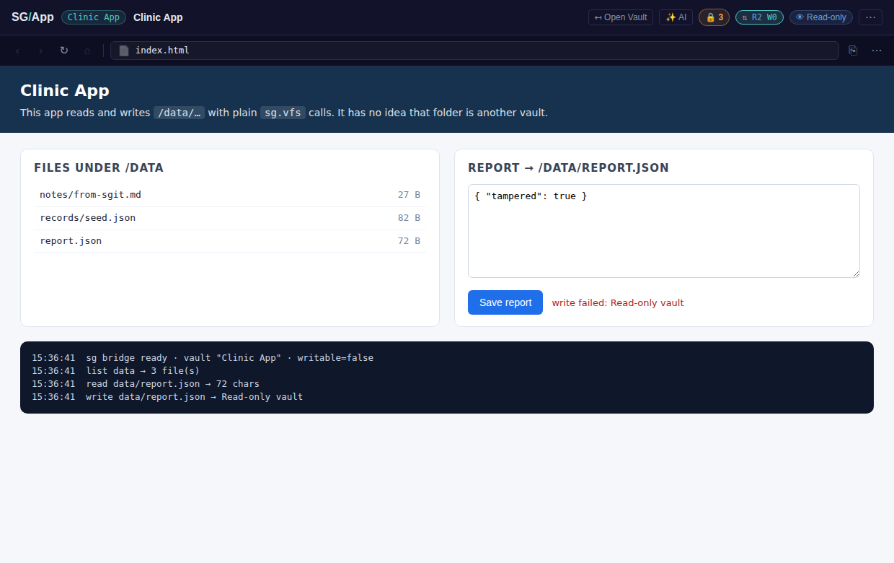

# Declared mounts, end to end — a vault app writing into another vault without knowing it

This guide walks through `tests/e2e/vault_ui/test__declared_mounts_e2e.spec.js`, a real-browser
test of **declared mounts** (07 Sep architect analysis). It doubles as the step-by-step recipe for
reproducing the capability by hand. Every screenshot below was taken by the test itself.

**What the test proves**

1. A vault app calls plain `sg.vfs.list('data')` / `sg.vfs.write('data/report.json', …)` and the
   bytes land in a **different vault** (the child). The app never calls `sg.vault.mount`, never sees
   a key, never learns that `data/` is another vault.
2. The parent vault stays untouched by those writes: it holds only the pointer (`data.link.json`)
   and the owner's sealed copy of the child key.
3. Another writer (what `sgit push` or a second browser tab is to the server) publishes to the
   child in between; the app's next write **reconciles first** (fast-forward) and publishes with
   a compare-and-swap, so nothing anyone wrote is lost.
4. The HUD's **Mounts** tab shows the declared mount, its access tier and its sync state.
5. A **read-only** parent session (read credential, format 6) mounts the child read-only: reads
   work, writes are refused, the child is untouched.

Nothing in the run is a mock: the real SGraph Send API (in-process FastAPI + Memory-FS, spawned for
the run), vaults created with the real crypto libraries, the shipped App UI, a real null-origin app
iframe and a real null-origin child kernel iframe.

---

## 1 · Run it

```bash
npm install                                   # jsdom + @playwright/test
# Python side: the API server. Any interpreter with the repo's requirements works;
# the fixtures look for .venv/bin/python3 first, then $SG_PYTHON, then python3.
npm run test:vault-e2e-declared-mounts        # the browser test (≈10 s)
npm run test:vault-live                       # the Node twin: 45 checks of the sync discipline
                                              #   against the real server, no browser (≈20 s)
```

Screenshots go to `test-results/declared-mounts-e2e/` by default; the ones in this guide were
produced with:

```bash
DECLARED_MOUNTS_SHOTS_DIR=$PWD/library/guides/vault-html/images/declared-mounts-e2e \
  npx playwright test tests/e2e/vault_ui/test__declared_mounts_e2e.spec.js
```

> **Offline / sandboxed environments.** The App UI page loads two scripts from CDNs (the
> `sg-layout` window manager from dev.tools.sgraph.ai, `sg-print` from dev.send.sgraph.ai). The spec
> routes both to local stand-ins (`tests/e2e/vault_ui/fixtures/sg-layout-offline.js` — a minimal
> two-column layout that is **not** part of the system under test — and an empty `sg-print`), so the
> test runs with no network at all. Chromium is picked up from `/opt/pw-browsers/chromium` when
> present (`PW_CHROMIUM_EXECUTABLE` overrides); a normal `npx playwright install` setup is untouched.

---

## 2 · What gets seeded (and how to do it by hand)

`tests/e2e/vault_ui/fixtures/sg-vault-node.js` runs the **real** browser libraries inside Node
(`SGSend`, `SGVault`, `VaultLinks`, `SGVaultOwnerSecrets`, `VaultDataSource`) and creates two vaults
with exactly the files the App UI's own "create sub-vault + link" flow writes:

| Vault | File | Why |
|---|---|---|
| **child** "Clinic Data" | `.vault/app.json` → `{ permissions: { fs: { read, write, delete, mkdir: true } } }` | the child's **own** policy — the second gate. A child that grants nothing refuses every cross-vault write (`EPERM`). |
| | `.vault/access-token.json` → `{ token }` | the child kernel's account-tier token, so a full-key child is writable without the parent forwarding its token |
| | `records/seed.json` | seed data the app will see under `/data/records/` |
| **parent** "Clinic App" | `.vault/app.json` → `{ entry: "index.html", permissions: { fs: { read: true, write: ["data/"], delete: ["data/"], mkdir: ["data/"] } } }` | the app's grant on the mount prefix — checked by the top kernel before any relay |
| | `index.html` | the app under test (`tests/e2e/vault_ui/fixtures/clinic-app.html`) |
| | `data.link.json` → `{ vault_id, ref_id, label }` | **the declaration**: `<name>.link.json` mounts the child at `/<name>/` |
| | `.vault/owner/secrets/<ref_id>.json` | the child's full key, sealed with a key derived from the parent's **write** key (`SGVaultOwnerSecrets`). Owner tier → mount is **rw**. |
| | `.vault/owner/ro-links.json` → `{ <ref_id>: { vault_id, read_key, ref_file_id, … } }` | read-key tier record → a read-only parent session still resolves the mount, **ro** |
| | `.vault/access-token.json` | parent writable on open (no entry-form token needed) |

To reproduce by hand, run the same helper against any server and print the keys:

```bash
node --input-type=module -e "
import { startApiServer } from './tests/e2e/vault_ui/fixtures/api-server.js';
import { seedDeclaredMounts } from './tests/e2e/vault_ui/fixtures/sg-vault-node.js';
import fs from 'node:fs';
const api  = await startApiServer();                      // or { url: 'https://dev.send.sgraph.ai', token: '…' }
const seed = await seedDeclaredMounts(api, { appHtml: fs.readFileSync('tests/e2e/vault_ui/fixtures/clinic-app.html','utf8') });
console.log(seed);                                        // parent.key, parent.readCredential, child.key, ref …
"
```

Then open `/en-gb/app` with `localStorage['sg-vault-key'] = <parent.key>` and
`window.SG_ENDPOINT = <api url>` (the test does this with `page.addInitScript`), or simply
`/#<parent.key>` on the served UI. **Never paste those keys into a commit.**

---

## 3 · Step by step

### Step 1 — the owner opens the app; the app lists `/data`



Under the hood, before the app iframe exists, the top kernel scanned the parent's file list, found
`data.link.json`, resolved credentials **owner-secret → ro-links → device key → legacy stub** (got
the full key from the owner secret, so `access: rw`) and registered a lazy `KernelParent.mount({
prefix: 'data/', ref, meta: { declared: true } })`. The broker policy for a declared mount is `auto`
for the fs verbs: the owner declared it and the app's own grant is still checked by `_can`, so a
second prompt naming a mount id would only reveal what the design hides.

`sg.vfs.list('data')` hit the mount → the child kernel was spawned on first use (a hidden
null-origin `srcdoc` iframe running the shipped `KERNEL_SHELL_HTML`), the parent delivered the
child's key + endpoint + `cloneBranch: 'viv:<parent id>'` over the PKI channel, the child opened the
vault, loaded every sub-folder, read its **own** `.vault/app.json`, and answered the list. The
listing hides `.vault/**` (the floor) and the child's `.vault-settings.json` (it would reveal the
child's identity).

### Step 2 — the app saves `/data/report.json`



Since 8 Sep the write resolves with a **receipt** — `{ path, size, commit_id, published: true }` —
the child's commit id and the outcome of its compare-and-swap publish, which the kernel used to discard.

`sg.vfs.write('data/report.json', bytes)` → top kernel: floor + app grant (`write: ['data/']`) →
broker → custody gate → tier gate → relay → **child kernel**: floor + the child's own grant →
`reconcile` (re-read the named ref; unchanged) → `saveFile` (commit on the `viv:<parent>` clone
branch, message carries the `Via-Mount: Clinic Data (declared)` trailer) → **`pushIfMatch`** (the
named ref is written with `write-if-match` against the exact ciphertext last read).

The test then opens both vaults from Node: the child has `report.json` with the trailer on its head
commit; the parent has `data.link.json` and **no** `report.json` anywhere.

### Step 3 — another writer publishes; the app writes again



Between the two app writes, a plain `SGVault` on its own clone branch (`sgit-cli`) adds
`notes/from-sgit.md` to the child and does a blind `push()` — exactly what `sgit push` or another
tab does. The app's next save reconciles first: the named ref moved, our clone is a clean ancestor
→ fast-forward, then commit, then CAS push. The test asserts from Node that the published head's
first parent **is** the other writer's commit (nothing overwritten) and that the app can read
`data/notes/from-sgit.md` straight away.

Had the other writer landed **between** our commit and our push, the CAS would have failed
(`ECAS`), the kernel would merge (three-way, `_conflict` copies if needed) and retry once; a second
`ECAS` is surfaced as `EDIVERGED` and the local commit is kept, never force-published. The Node
twin (`npm run test:vault-live`) exercises that exact race.

### Step 4 — the HUD Mounts tab



Debug panel → **🔗 Mounts**. The row shows the mount id, prefix, custody (`parent-held`),
isolation, `declared`, access tier (`rw`) and the sync tag (`clean`) reported by the child kernel's
`vfs.status`. The test calls `KernelParent.syncAll()` first — the same call the tab-focus
behind-check makes — so the column is populated. Below it, the broker log: three ops, all
`std · auto · ok`.

### Step 5 — a read-only parent



The parent is opened with its **read credential** (`<read_key hex>:<vault_id>`, format 6). The
owner-secret store cannot be decrypted (no write key) so the resolver falls through to
`ro-links.json` and mounts the child with a read credential → the child kernel opens read-only.
Listing and reading work; `sg.vfs.write` is refused (`EREADONLY`) and the test verifies from Node
that the child's head did not move.

---

## 4 · The sync discipline, in one table

| Verb | What the child kernel does |
|---|---|
| `vfs.read` / `vfs.list` | throttled **refresh-before-read** (`REFRESH_MS`, default 5 s): re-read the named ref; if it moved and the view is clean, fast-forward (or reload, read-only) and notify `/` |
| `vfs.write` / `delete` / `mkdir` | **reconcile-before-write**: re-read the named ref; moved → merge (FF or three-way); then mutate + commit; then **CAS push**. `ECAS` → reconcile + retry once → `EDIVERGED` |
| `vfs.status` | `{ syncable, writable, head, named, serverHead, ahead, behind, diverged, lastPush, lastMerge, lastError, state }` — one ref read |
| `vfs.move` (8 Sep) | reconcile-before-write; rename or move **inside** the child; receipt. The parent refuses cross-boundary moves with `EXDEV` before they get here |
| `vfs.sync` | reconcile; publish anything a failed push left behind; notify `/`; return status + `changed` |

`vfs.status` and `vfs.sync` are **kernel-internal** verbs (parent ↔ child). Apps never call them;
apps get the write's receipt (`{ commit_id, published }`) and the `sg.vault.mounts()` projection.

Parent side: `KernelParent.status(mountId)`, `sync(mountId)`, `syncAll()`; `list()` carries the last
result as `sync`, rendered by the Mounts tab. `app-shell._checkBehind` (tab focus) calls `syncAll()`.

Error codes an app may see through a mount: `EPERM` (a grant is missing on either side),
`EPROTECTED` (floor), `EREADONLY` (child not writable), `EUNREACH` (child boot / push failure — the
child now reports the real cause with `boot-error`), `EDIVERGED` (see above).

---

## 5 · What the test found (fixed in the same change)

Running the shipped code against a real child vault in a real browser surfaced six defects that the
Node harnesses (synthetic vaults, `globalThis` overrides) could not see:

1. **Child bootstrap message lost** — the port was posted before the `srcdoc` iframe had loaded, so
   the kernel never received `init`; the relay stayed `pending` forever. `_spawnChildChannel` now
   waits for `load`, and `SecureChannel.create` accepts `timeoutMs`.
2. **`SGSend is not a constructor`** — the shipped libraries are top-level `class` declarations
   (global lexical bindings, not `globalThis` properties); the bootstrap only looked at `globalThis`.
3. **Child policy never read** — the app.json reader called `vault.getFileBytes`, which a real
   `SGVault` does not have; every child write was `EPERM "no capability"`.
4. **`vfs.list` threw** on a real data source (`ds.listFolder is not a function`).
5. **Lazy sub-folders** — a child kernel never expanded them, so listings were empty and a nested
   write after a reconcile would have dropped the folder's other files (`VaultDataSource.saveFile`
   now loads a lazy target folder first, as `getFileBytes` always did).
6. **Silent boot failures** — a thrown `secrets` handler was swallowed; the parent only ever saw a
   10-second timeout. The child now logs and sends `boot-error`.

---

## 6 · Against a deployed environment ("is it live?")

Both tests accept a deployed target through environment variables; the fixtures then spawn
nothing and the browser drives the deployed UI:

| Variable | Effect |
|---|---|
| `SG_API_URL` | use this API instead of spawning `api-server.py` |
| `SG_ACCESS_TOKEN` (or `SGRAPH_SEND__ACCESS_TOKEN`) | account token for writes on that API |
| `SG_UI_BASE` | e2e only: open this UI (e.g. `https://dev.vault.sgraph.ai`) instead of the local file server; the CDN scripts are loaded for real |
| `SG_REQUIRE_API=1` | make a missing API server a failure instead of a skip |

```bash
# read-only marker probe, no token. Exit 0 = live, 1 = an older build is served,
# 2 = the UI could not be reached (a network result — NOT evidence of a failed deploy).
npm run probe:vault-ui -- https://dev.vault.sgraph.ai https://dev.send.sgraph.ai
# server-side contract with the shipped handlers (Node)
SG_API_URL=https://dev.send.sgraph.ai SG_ACCESS_TOKEN=… npm run test:vault-live
# the deployed UI in a real browser
SG_UI_BASE=https://dev.vault.sgraph.ai SG_API_URL=https://dev.send.sgraph.ai SG_ACCESS_TOKEN=… SG_REQUIRE_API=1 \
  npm run test:vault-e2e-declared-mounts
```

The brief for other agents (`team/comms/briefs/09/07/v0.33.64__brief__declared-mounts-and-child-kernel-sync-on-dev.md`)
walks through the three levels.

## 7 · Files

| File | Role |
|---|---|
| `tests/e2e/vault_ui/test__declared_mounts_e2e.spec.js` | the browser test (4 serial tests, screenshots) |
| `tests/e2e/vault_ui/fixtures/clinic-app.html` | the app under test — copy it as a starting point |
| `tests/e2e/vault_ui/fixtures/sg-vault-node.js` | real vault libraries in Node; `seedDeclaredMounts`, `openAll`, `openReadOnlyAll` |
| `tests/e2e/vault_ui/fixtures/api-server.{py,js}` | the real API server for a run (or a deployed one via `SG_API_URL`) |
| `scripts/probe_vault_ui_capabilities.mjs` | deployed-UI capability probe (`npm run probe:vault-ui`) |
| `tests/e2e/vault_ui/fixtures/sg-layout-offline.js` | offline stand-in for the CDN layout manager (test infra only) |
| `tests/integration/vault_ui/live/test__child_kernel_sync_live.js` | the Node twin: CAS, reconcile, race, read-only refresh, status/sync, throttle |
| `tests/unit/vault_ui/loader/test__kernel_app_handlers_sync.js` | controlled-failure unit tests (`EDIVERGED`, throttle, real-shaped data source) |
| `library/guides/vault-html/SUB-VAULTS-AND-LINKS.md`, `EXTRACT-AND-EMBED-A-SUB-VAULT.md` | the link-file / owner-record model this builds on |
